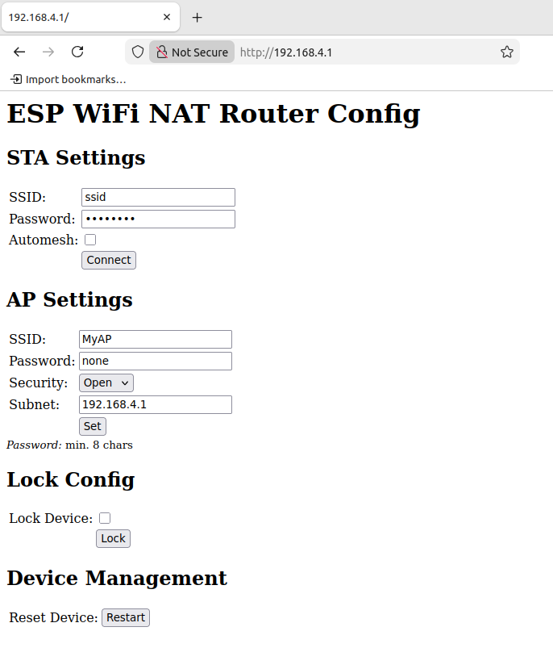
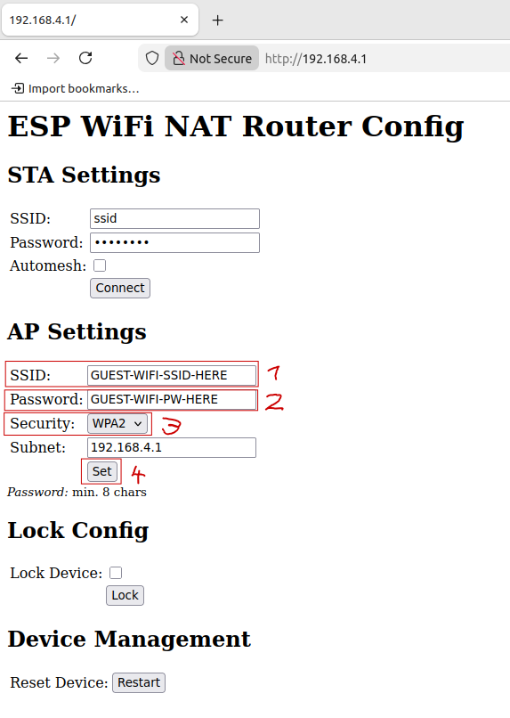
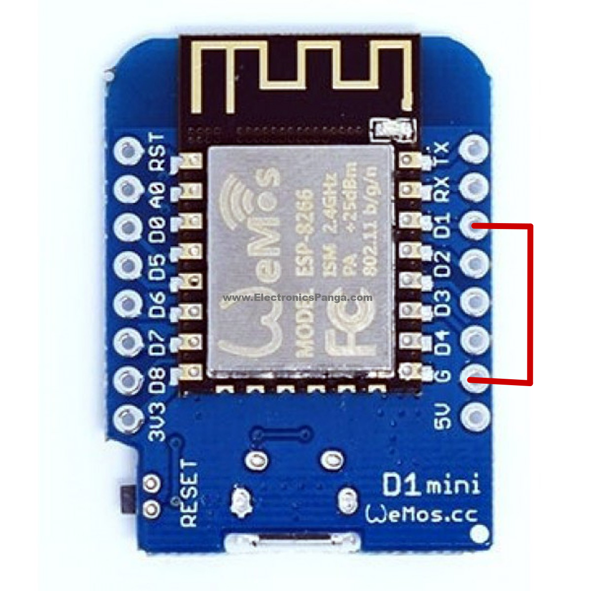

# reader-rollout-helpers
## Initiale  Konfiguration:

SSID: MyAP
 PW: 
 IP: 192.168.4.1
 Wifi-AP-Interface: http://192.168.4.1

## Konfiguration editieren

## Factory Reset

### PIN "G" (ground) mit PIN "D1" (gpio5) für ca 3 sek. verbinden.

